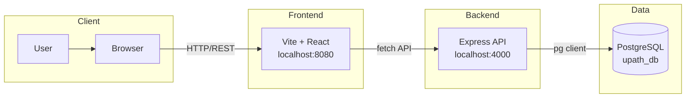

# UPath

## App Summary

UPath helps youth and underrepresented communities navigate career paths and connect with mentors. The application provides a single platform to explore careers, track personal milestones, and book one-on-one meetings with experienced mentors. In **demo mode** you select a student profile from the app bar; goals, progress, mentor sessions, and saved preferences are then scoped to that profile. Features include: dashboard with onboarding checklist, goal and milestone tracking (DB-backed), mentor browse/book/cancel and "My sessions," Explore with persisted interests and career-path selections, career match details, and Resources with optional bookmarks. The stack is fully wired from React through Express to PostgreSQL.

## Tech Stack

| Layer | Technologies |
| ----- | ------------ |
| **Frontend** | React 18, TypeScript, [Vite](https://vitejs.dev/), Tailwind CSS, [shadcn/ui](https://ui.shadcn.com/) (Radix), React Router, [TanStack Query](https://tanstack.com/query/latest) |
| **Backend** | Node.js, [Express](https://expressjs.com/), CORS, [dotenv](https://www.npmjs.com/package/dotenv) |
| **Database** | [PostgreSQL](https://www.postgresql.org/), [pg](https://node-postgres.com/) client |
| **Auth** | None; uses a default mentee ID for demo purposes |
| **External services** | None |

## Architecture Diagram



## Prerequisites

Install the following before running the project locally:

- **Node.js** (v18+) — [nodejs.org](https://nodejs.org/) or [nvm](https://github.com/nvm-sh/nvm#installing-and-updating)  
  Verify: `node --version` and `npm --version`
- **PostgreSQL** (14+) — [postgresql.org/download](https://www.postgresql.org/download/)  
  Verify: `psql --version`
- **psql** in system PATH (included with PostgreSQL)  
  Verify: `which psql` or `psql --version`

## Installation and Setup

1. Clone the repository and navigate into it:
   ```sh
   git clone <YOUR_GIT_URL>
   cd UPath
   ```

2. Install frontend dependencies (project root):
   ```sh
   npm install
   ```

3. Install backend dependencies:
   ```sh
   cd backend && npm install && cd ..
   ```

4. Create the database:
   ```sh
   psql -U <your_username> -f db/schema.sql
   ```
   Use `-h localhost` if connecting to a remote host.

5. Run migrations (for preferences, resources, and indexes):
   ```sh
   psql -U <your_username> -d upath_db -f db/migrations/001_add_mentor_fields.sql
   psql -U <your_username> -d upath_db -f db/migrations/002_student_preferences.sql
   psql -U <your_username> -d upath_db -f db/migrations/003_resources_and_bookmarks.sql
   psql -U <your_username> -d upath_db -f db/migrations/004_indexes_and_constraints.sql
   ```

6. Seed the database:
   ```sh
   psql -U <your_username> -d upath_db -f db/seed.sql
   psql -U <your_username> -d upath_db -f db/seed-resources.sql
   ```
   Run `seed-resources.sql` only if you applied the resources migration (step 5).

7. Configure environment variables:
   - **Root**: Copy `.env.example` to `.env`. Set `VITE_API_BASE_URL=http://localhost:4000` (default).
   - **Backend**: Copy `backend/.env.example` to `backend/.env`. Set `PGUSER`, `PGPASSWORD`, `PGHOST`, `PGPORT`, `PGDATABASE`, and `FRONTEND_ORIGIN=http://localhost:8080`.

## Running the Application

1. Start the backend (in one terminal):
   ```sh
   cd backend && npm run dev
   ```
   The API listens on port 4000.

2. Start the frontend (in another terminal, from project root):
   ```sh
   npm run dev
   ```
   The app is served at port 8080.

3. Open [http://localhost:8080](http://localhost:8080) in your browser.

4. (Optional) Run tests:
   - Frontend: `npm test` (from project root)
   - Backend: `cd backend && npm test` (requires DB and env)

## Verifying the Vertical Slice

The app uses **demo mode**: pick a student profile from the "Demo profile" dropdown in the app bar to see user-specific goals, progress, and mentor sessions.

1. Open [http://localhost:8080](http://localhost:8080) and click **Go to my dashboard** (or go to `/dashboard`).
2. Select a demo profile (e.g. Avery Coleman or Jordan Nguyen) from the dropdown.
3. **Dashboard**: See current goal, progress, and next mentor session. Use the onboarding checklist to set a goal, connect with a mentor, or explore careers.
4. **Milestones** (`/milestones`): View and mark milestones complete for your goal. Use "Choose a goal" if none is set.
5. **Mentors** (`/mentors`): Book or cancel a mentor; "My sessions" lists your scheduled meetings.
6. **Explore** → **Find My Path**: Select career paths and interests; they are saved when you have a profile. **Careers** shows matches (ordered by your selections).
7. **Resources**: Browse and (with a profile) bookmark resources. Uses DB if migrations and `seed-resources.sql` were run; otherwise falls back to static data.

To verify mentor booking in the database:
```sql
SELECT mentor_id, mentee_id, "time", meetingstatus FROM meetings WHERE meetingstatus = 'scheduled';
```
