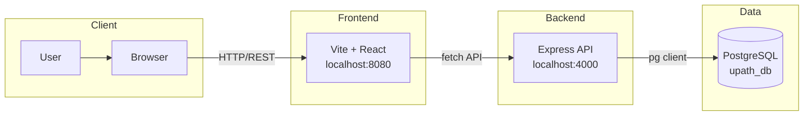

# UPath

## App Summary

UPath helps youth and underrepresented communities navigate career paths and connect with mentors. The application addresses the challenge of discovering career options and accessing guidance by providing a single platform to explore careers, track personal milestones, and book one-on-one meetings with experienced mentors. Users can browse mentors by specialty, view availability, and schedule or cancel meetings directly from the app. The Mentors feature demonstrates a full vertical slice—from the React UI through the Express API to the PostgreSQL database—ensuring that bookings persist and availability updates in real time.

## Tech Stack

| Layer | Technologies |
| ----- | ------------ |
| **Frontend** | React 18, TypeScript, [Vite](https://vitejs.dev/), Tailwind CSS, [shadcn/ui](https://ui.shadcn.com/) (Radix), React Router, [TanStack Query](https://tanstack.com/query/latest) |
| **Backend** | Node.js, [Express](https://expressjs.com/), CORS, [dotenv](https://www.npmjs.com/package/dotenv) |
| **Database** | [PostgreSQL](https://www.postgresql.org/), [pg](https://node-postgres.com/) client |
| **Auth** | None; uses a default mentee ID for demo purposes |
| **External services** | None |

## Architecture Diagram



## Prerequisites

Install the following before running the project locally:

- **Node.js** (v18+) — [nodejs.org](https://nodejs.org/) or [nvm](https://github.com/nvm-sh/nvm#installing-and-updating)  
  Verify: `node --version` and `npm --version`
- **PostgreSQL** (14+) — [postgresql.org/download](https://www.postgresql.org/download/)  
  Verify: `psql --version`
- **psql** in system PATH (included with PostgreSQL)  
  Verify: `which psql` or `psql --version`

## Installation and Setup

1. Clone the repository and navigate into it:
   ```sh
   git clone <YOUR_GIT_URL>
   cd UPath
   ```

2. Install frontend dependencies (project root):
   ```sh
   npm install
   ```

3. Install backend dependencies:
   ```sh
   cd backend && npm install && cd ..
   ```

4. Create the database:
   ```sh
   psql -U <your_username> -f db/schema.sql
   ```
   Use `-h localhost` if connecting to a remote host.

5. Seed the database:
   ```sh
   psql -U <your_username> -d upath_db -f db/seed.sql
   ```

6. Configure environment variables:
   - **Root**: Copy `.env.example` to `.env`. Set `VITE_API_BASE_URL=http://localhost:4000` (default).
   - **Backend**: Copy `backend/.env.example` to `backend/.env`. Set `PGUSER`, `PGPASSWORD`, `PGHOST`, `PGPORT`, `PGDATABASE`, and `FRONTEND_ORIGIN=http://localhost:8080`.

## Running the Application

1. Start the backend (in one terminal):
   ```sh
   cd backend && npm run dev
   ```
   The API listens on port 4000.

2. Start the frontend (in another terminal, from project root):
   ```sh
   npm run dev
   ```
   The app is served at port 8080.

3. Open [http://localhost:8080](http://localhost:8080) in your browser.

## Verifying the Vertical Slice

The Mentor booking feature demonstrates a full vertical slice from UI to database. Use these steps to verify end-to-end behavior:

1. Open [http://localhost:8080](http://localhost:8080) and navigate to **Mentors** (via the nav or `/mentors`).
2. Identify an available mentor (badge shows "Available" and a "Book Now" button).
3. Click **Book Now**. You should see a success toast, and the mentor card should update to "Booked" with a "Cancel Booking" button.
4. **Verify in the database**: Run
   ```sql
   SELECT mentor_id, mentee_id, "time", meetingstatus FROM meetings WHERE meetingstatus = 'scheduled';
   ```
   The new booking should appear in the results.
5. **Verify persistence**: Refresh the page. The mentor should still show "Booked".
6. **Optional**: Click **Cancel Booking**, refresh the page, and confirm the mentor is available again.
